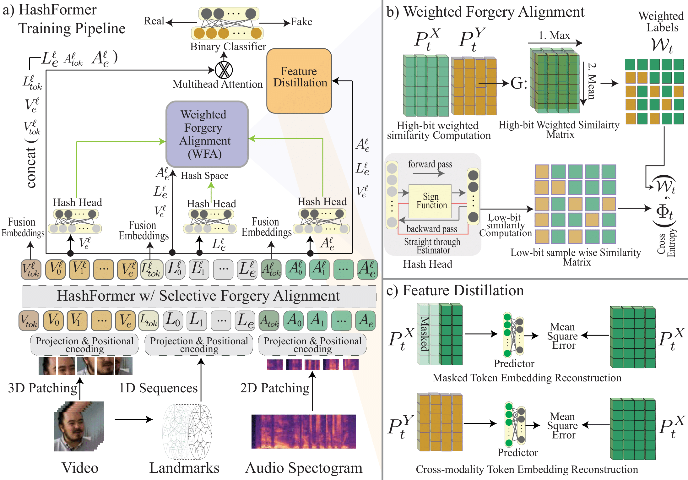

# HashFormer: Contrastive Hashing with a Unified Temporal Transformer for Robust Audio-Visual Deepfake Detection

Author: anonymous

[](LICENSE) [](https://www.python.org/) [](https://pytorch.org/)

- [Introduction](#introduction)
- [What's in this repo?](#whats-in-this-repo)
- [The HashFormer Model](#the-hashformer-model)
- [Data Preparation](#data-preparation)
    - [Extract audio track, image frames, and landmarks from the video](#extract-audio-track-image-frames-and-landmarks-from-the-video)
- [HashFormer Pretraining](#hashformer-pretraining)
    - [Run HashFormer pretraining](#run-hashformer-pretraining)
- [Visual-Only Deepfake Benchmark](#visual-data)
  - [DF-TMIT](#DeepSpeak)
  - [Faceforensics++](#Faceforensics++)
- [Audio-Visual Deepfake Benchmark](#audio-visual-data)
  - [DeepSpeak](#DeepSpeak)
  - [FakeAVCeleb](#FakeAVCeleb)
  - [DFDC](#DFDC)
  - [KoDF](#KoDF)
- [Inference](#inference)
- [Pretrained Models](#pretrained-models)
    - [HashFormer Pretrained Models (Main)](#hashformer-pretrained-models-main)
    - [HashFormer Pretrained Models (Ablation Study)](#hashformer-pretrained-models-ablation-study)
    - [HashFormer Pretrained+Finetuned Models](#hashformer-pretrainedfinetuned-models)
- [Contact](#contact)

## Introduction
<p align="center">

</p>

This repository contains the official implementation (in PyTorch) of HashFormer, proposed in the paper HashFormer: Contrastive Hashing with a Unified Temporal Transformer for Robust Audio-Visual Deepfake Detection (Anonymous submission).

HashFormer is a lightweight, modality-agnostic framework for multimodal audio-visual deepfake detection. It leverages Weighted Forgery Alignment (WFA) for nuanced inter- and intra-modality similarity mining, Selective Forgery Alignment (SFA) for controlled attention in a unified transformer, and landmark-based self-distillation for focusing on deepfake-relevant features. Our experiments demonstrate state-of-the-art (SOTA) performance on benchmarks like DF-TIMIT, DFDC, FakeAVCeleb, KoDF, DeepSpeak, and FaceForensics++.

## What's in this repo?

This repo contains everything to reproduce our experiments and adapt HashFormer to your tasks. Specifically:

- The `HashFormer` model script is in [`models/model.py`](models/model.py).
- Data preprocessing scripts are in [`data_preprocessing/`](data_preprocessing/).
- Training pipelines: [`pre_train.py`](pre_train.py) (pretraining), [`train.py`](train.py) (training), [`val.py`](val.py) (validation), [`inference.py`](inference.py) (inference).
- Datasets loaders: [`dataloaders/datasets.py`](dataloaders/datasets.py) and [`dataloaders/faceswapVideoDataset.py`](dataloaders/faceswapVideoDataset.py).
- Utility scripts: [`compute_metrics.py`](compute_metrics.py) (metrics), [`difmap.py`](difmap.py) (difference maps), [`util.py`](util.py) (utils).
- Pretrained models and data lists: Detailed below.

## The HashFormer Model 

The proposed *HashFormer* models are in [`models/model.py`](models/model.py), with `HashFormer` as the core class. In general, the code is self-contained and commented; the best way to understand details is by reading the code.
The input should be audio (MFCC), video frames, and landmarks. The shape of audio is [B, T, mel_bins] (e.g., [B, 1000, 128]); video is [B, T, C, H, W] (e.g., [B, 25, 3, 224, 224]); landmarks are [B, T, 2*landmarks].
The `HashFormer` model, with default arguments, is used in the paper. Customizable features:
- Masking ratios for audio/video can differ.
- Structured masking (time, freq, time-freq) available via `mask_mode`.
- Symmetric contrastive loss implemented.
- Skip contrastive/MAE loss via `mae_loss_weight` and `contrast_loss_weight`.

## Data Preparation

Reproduce our pipeline with data in our format.

#### Step 1. Extract audio track, image frames, and landmarks from the video
Use [`data_preprocessing/preprocess.py`](data_preprocessing/preprocess.py) or [`preprocess_dlib.py`](data_preprocessing/preprocess_dlib.py).
```bash
python data_preprocessing/preprocess.py --base_dir /path/to/raw/videos --output_dir /path/to/processed --num_gpus 4
```
Outputs: cropped_video.mp4, *.wav, landmarks.npy.

#### Step 2. Build a label set and file list for your dataset
Labels CSV: Manipulation label (e.g., real, fake).
File list: Built via [`dataloaders/datasets.py`](dataloaders/datasets.py)'s build_file_list (paths, labels, multi-labels).
See sample files in repo. Supported: DF-TIMIT, DFDC, FakeAVCeleb, KoDF, DeepSpeak, FaceForensics++.


## hashformer-pretraining
#### Step 1. Build a environment and install pacages
```bash
conda create -n hashformer python=3.8
conda activate hashformer
conda install pytorch==1.12.1 torchvision==0.13.1 torchaudio==0.12.1 cudatoolkit==11.4 -c pytorch -c nvidia -c conda-forge
pip install -r requirements.txt
```

#### Step 2. Run HashFormer
Before you run this code you should download the datasets and matching the dataloader
To pretrain the model you should run:
```bash
bash pre_train.sh
```
To train the pre-trained model for classification you should run as follows:
```bash
bash train.sh
```

To validate the pre-trained model for classification you should run as follows:
```bash
bash val.sh
```
## Visual-Data
Use train.py daynamically adapted for visual data.
- DF-TMIT
- Faceforensics++
- ASVSpoof2019

## Audio-Visual-Data
Use train.py for multimodal training.
- DeepSpeak
- FakeAVCeleb
- DFDC
- KoDF

## Inference
Script: [`inference.py`](inference.py)
```bash
python inference.py --video_path /path/to/video.mp4 --checkpoint /path/to/model.pt
```
